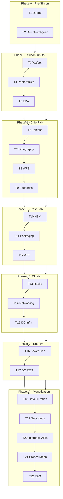

# Value Chain — Visualization Data Reference

**Purpose:** Single working document for building charts, diagrams, and interactive views from the AI Infrastructure Value Chain (7 phases · 22 tiers). All factual content is sourced from the live Value Chain page and its data module — not duplicated as a second source of truth.

**Live page:** `/value-chain` · **Canonical data:** `frontend/src/data/aiInfraData.js` · **Page docs:** [06_value_chain.md](./06_value_chain.md)

---

## 1. Stack at a glance

| Metric | Value |
|--------|------:|
| Macro phases | 7 (Phase 0 → Phase VI) |
| Tiers | 22 |
| Essential tiers (`essential: true`) | 17 |
| Non-essential tiers | 5 (T4, T12, T13, T17, T21) |
| Watchlist names (total) | 21 |
| Watchlist mapped to stack | 8 |
| Watchlist unmapped (other themes) | 13 |
| Unique named players across all tiers | ~90+ (see §6) |

**Narrative arc:** Raw earth & grid hardware → silicon inputs → chip fab → post-fab assembly → rack & cluster → power & land → compute monetisation (data → neocloud → tokens → orchestration → RAG).

**Hero copy (page):** *"22 tiers · 7 phases · from raw earth to token monetisation"* · *"Structure before signals · Reference map for the physical stack"*

**Start-here thesis:** Every tier is a potential single point of failure. If one link jams, the global AI engine halts.

### Live infographic (deployed)

| Item | Path |
|------|------|
| Design source | `docs/AIchain.jpg` |
| Public asset | `frontend/public/images/ai-infra-value-chain.jpg` |
| React component | `frontend/src/components/value-chain/ValueChainInfographic.jsx` |
| URL | `/images/ai-infra-value-chain.jpg` |

Shown below the Value Chain hero on `/value-chain`. Desktop: full-width framed panel + lightbox. Mobile: horizontal scroll (min-width preserves legibility) + tap-to-enlarge.

---

## 2. Data sources & schema

### Primary module (`aiInfraData.js`)

| Export | Fields | Use in viz |
|--------|--------|------------|
| `PHASES` | `id`, `number`, `label`, `name`, `tierRange`, `focus`, `thesisRole`, `color`, `insight` | Phase bands, color scale, sankey layers |
| `TIERS` | `id`, `tier`, `phase`, `name`, `subtitle`, `essential`, `role`, `players[]`, `moat`, `bottleneck`, `metric`, `sigil_angle` | Node detail, tooltips, filter dimensions |
| `WATCHLIST_TIER_MAP` | ticker → `{ tier, note }` | Portfolio overlay, holdings heatmap |

### ID contract (for linking views)

- **`tier.tier`** — integer **1–22** (URLs: `?tier=10`, watchlist map, cross-refs)
- **`tier.id`** — slug only (`"t10"`) — React keys, not for maps
- **`phase.number`** — integer **0–6** (URLs: `?phase=3`)
- **`phase.id`** — slug (`"phase3"`)

### Related context (not in `aiInfraData.js`)

| Source | Relevant content |
|--------|------------------|
| `config/thesis.js` | Full 21-ticker watchlist, theme IDs, bull/bear signals |
| `frontend/src/data/masteryGuideData.js` | AI Infra theme concepts, **Bottleneck Migration** timeline, picks-and-shovels mental models |
| `docs/06_value_chain.md` | Archived **Risk Overlays** (3 institutional sizing lenses) |

---

## 3. Phase reference (visual palette)

Use `color` for phase bands, node grouping, and legend keys.

| # | Label | Name | Tiers | Count | Color | Focus | Thesis role |
|---|-------|------|-------|------:|-------|-------|-------------|
| 0 | Phase 0 | Pre-Silicon & Industrial Infrastructure | 1–2 | 2 | `#6B6B6B` | High-purity quartz, transformers, grid hardware | Absolute physical foundations — the most overlooked chokepoints |
| 1 | Phase I | Upstream Silicon Inputs | 3–5 | 3 | `#7F77DD` | Silicon wafers, advanced chemicals, EDA software | Supply chain moats and IP gatekeeping |
| 2 | Phase II | Chip Fabrication & Supply | 6–9 | 4 | `#00C896` | Fabless designers, lithography, foundries | Geopolitical single points of failure |
| 3 | Phase III | Post-Fab Assembly | 10–12 | 3 | `#EF9F27` | HBM memory, advanced packaging, chip testing | Near-term physical constraints — where the current bottleneck lives |
| 4 | Phase IV | System Architecture & Cluster Connectivity | 13–15 | 3 | `#378ADD` | Server racks, networking, liquid cooling hardware | Overcoming the 100kW+ rack and thermal barrier |
| 5 | Phase V | Physical Assets & Energy Grid | 16–17 | 2 | `#D85A30` | Power generation, datacentre real estate | The ultimate structural bottleneck — megawatts, not gigaflops |
| 6 | Phase VI | Compute Execution & Data Fabric | 18–22 | 5 | `#639922` | Data curation, neoclouds, inference, orchestration, RAG | The operating layer where physical compute is monetised |

### Phase insights (annotation text for tooltips / callouts)

| Phase | Insight |
|-------|---------|
| 0 | Before a single chip is made, the entire supply chain depends on a single mountain in North Carolina and transformer factories with 4-year backlogs. Most investors skip this layer entirely. |
| 1 | Three Japanese companies control the chemicals that make EUV lithography possible. A seismic event in the wrong prefecture freezes global fab operations within weeks. |
| 2 | ASML has a 100% monopoly on EUV. TSMC has >90% share of advanced nodes. Two companies — one Dutch, one Taiwanese — control whether the AI supercycle continues. |
| 3 | CoWoS packaging capacity was the binding constraint on H100 supply in 2024 — more than GPU fab capacity itself. The bottleneck was one layer below where everyone was looking. |
| 4 | A 120kW AI rack melts under air cooling. Liquid cooling is not optional — it is load-bearing infrastructure. Vertiv and nVent are gating factors for datacentre density. |
| 5 | Grid interconnection queues exceed 5 years in the US. You cannot build a datacentre faster than the power can be approved. Energy is the terminal bottleneck of the entire stack. |
| 6 | This is where atoms become revenue. Neoclouds buy GPUs, sell GPU-hours. The moat here is not technology — it is Nvidia tier-1 allocation priority and cluster utilisation rate. |

### Tier count by phase (bar / donut chart)

```text
Phase 0: ██ (2)
Phase 1: ███ (3)
Phase 2: ████ (4)
Phase 3: ███ (3)
Phase 4: ███ (3)
Phase 5: ██ (2)
Phase 6: █████ (5)
```

---

## 4. Tier master table (visualization-ready)

Compact index — expand detail in §5.

| Tier | Phase | Name | Subtitle | Essential | Holdings |
|-----:|-------|------|----------|:---------:|----------|
| 1 | 0 | High-Purity Quartz & Critical Minerals | The Raw Earth Chokepoint | ✓ | FCX |
| 2 | 0 | Heavy Grid Components & Electrical Switchgear | The Utility Gatekeepers | ✓ | — |
| 3 | 1 | Silicon Wafers & Substrates | The Raw Foundation | ✓ | — |
| 4 | 1 | Advanced Chemicals & Photoresists | The Atomic Ink | | — |
| 5 | 1 | EDA Software & IP Blocks | The Architecture Blueprints | ✓ | — |
| 6 | 2 | Fabless Chip Designers | The AI Brains | ✓ | NVDA |
| 7 | 2 | Lithography Equipment | The Printing Press | ✓ | — |
| 8 | 2 | Wafer Fab Equipment (WFE) | The Atomic Tools | ✓ | AMAT |
| 9 | 2 | Foundries / Fabs | The Heavy Industry | ✓ | — |
| 10 | 3 | AI Memory — HBM / DRAM | The Data Pipeline | ✓ | 000660.KS, MU |
| 11 | 3 | Advanced Packaging | The Silicon Bridge | ✓ | — |
| 12 | 3 | Automatic Test Equipment (ATE) | The Quality Gatekeeper | | — |
| 13 | 4 | Server System Architecture & Rack Integration | OEMs / ODMs | | — |
| 14 | 4 | High-Speed Networking & Optical Interconnects | The Cluster Nervous System | ✓ | — |
| 15 | 4 | Data Center Physical Infrastructure | Thermal & Power Management | ✓ | — |
| 16 | 5 | Power Generation & Utility Infrastructure | The Terminal Bottleneck | ✓ | — |
| 17 | 5 | Wholesale Data Center Real Estate | The Land & Power Rights Play | | — |
| 18 | 6 | Upstream Data Curation & Synthetic Data Engines | The Input Filter | ✓ | — |
| 19 | 6 | Compute Operators & Neoclouds | GPU-as-a-Service | ✓ | — |
| 20 | 6 | Managed Inference & Serverless API Fabrics | The Token Layer | ✓ | — |
| 21 | 6 | Cluster Orchestration & Distributed Software Fabrics | The Cluster Conductor | | PATH |
| 22 | 6 | Enterprise Data Engines & Retrieval Infrastructure | The Grounding Layer (RAG) | ✓ | CSU.TO, VEEV |

**Essential tier IDs:** 1, 2, 3, 5, 6, 7, 8, 9, 10, 11, 14, 15, 16, 18, 19, 20, 22

**Tiers with watchlist exposure:** 1, 6, 8, 10, 21, 22 (6 unique tiers, 8 ticker entries)

---

## 5. Full tier detail (for rich tooltips & node panels)

### Phase 0 — Pre-Silicon & Industrial Infrastructure

#### Tier 1 · High-Purity Quartz & Critical Minerals
- **Role:** Extreme-purity quartz for silicon crucibles; Spruce Pine, NC ≈ 80–90% of semiconductor-grade HPQ.
- **Players:** Sibelco / I-Minerals; Sovereign extractors
- **Moat:** Geologic monopoly — cannot be replicated at commercial scale.
- **Bottleneck:** Geographic concentration; seismic/ecological disruption at Spruce Pine freezes wafer production.
- **Key metric:** Grade-I quartz spot spreads; long-term supply contract duration.
- **Sigil angle:** Most overlooked SPOF; not tradeable equity but anchors physical supply-chain risk framing.
- **Holdings:** FCX (copper mining — grid expansion & datacentre wiring; mapped to raw-materials layer)

#### Tier 2 · Heavy Grid Components & Electrical Switchgear
- **Role:** Step-down transformers, switchgear, substations — datacentre power delivery.
- **Players:** Eaton; Schneider Electric; Siemens Energy; GE Vernova
- **Moat:** Industrial backlog; hand-wound transformers, limited global facilities.
- **Bottleneck:** 3–4 year transformer backlogs gate power turn-on dates.
- **Key metric:** Backlog-to-revenue conversion; pricing on custom electrical skids.
- **Sigil angle:** Building in 18 months vs transformer queue in 3 years — investment thesis for Tier 16 energy plays.

### Phase I — Upstream Silicon Inputs

#### Tier 3 · Silicon Wafers & Substrates
- **Players:** Shin-Etsu (~30%); SUMCO (~25%); Siltronic; GlobalWafers
- **Bottleneck:** Furnace capacity; gallium/germanium export controls (China).
- **Sigil angle:** Japan ~55% of global wafer supply — seismic or export-control risk.

#### Tier 4 · Advanced Chemicals & Photoresists *(non-essential)*
- **Players:** TOK; JSR; Merck KGaA; Shin-Etsu
- **Bottleneck:** Japan geographic concentration; EUV photoresist single-source risk.
- **Sigil angle:** Invisible supply chain — three Japanese companies gate frontier fab.

#### Tier 5 · EDA Software & IP Blocks
- **Players:** Synopsys (~35%); Cadence (~30%); Siemens EDA; ARM
- **Moat:** Near-100% switching costs; NRR > 115%.
- **Bottleneck:** Simulation compute time delays tape-out.

### Phase II — Chip Fabrication & Supply

#### Tier 6 · Fabless Chip Designers
- **Players:** Nvidia; AMD; Broadcom; Apple; Qualcomm
- **Moat:** CUDA / software ecosystems — moat is software, not silicon.
- **Bottleneck:** Total reliance on external foundry capacity.
- **Holdings:** NVDA
- **Sigil angle:** Physical GPU scarcity play; CUDA lock-in + order backlog into 2027.

#### Tier 7 · Lithography Equipment
- **Players:** ASML (100% EUV monopoly); Carl Zeiss; Trumpf
- **Moat:** $350M+ High-NA EUV; 25 years / €6B+ R&D; ~60 machines/year.
- **Bottleneck:** Assembly/calibration limits; China export controls.

#### Tier 8 · Wafer Fab Equipment (WFE)
- **Players:** AMAT; Lam Research; Tokyo Electron; ASM International; Lasertec
- **Holdings:** AMAT
- **Sigil angle:** Second-order datacenter play — WFE benefits 12–18 months before GPU supply increases.

#### Tier 9 · Foundries / Fabs
- **Players:** TSMC (>60% total, >90% sub-5nm); Samsung Foundry; Intel Foundry
- **Bottleneck:** Taiwan geopolitical concentration — core bear case.
- **Sigil angle:** Taiwan Strait risk anchors hardware supply thesis.

### Phase III — Post-Fab Assembly

#### Tier 10 · AI Memory — HBM / DRAM
- **Players:** SK Hynix (HBM3e leader); Micron; Samsung
- **Bottleneck:** HBM uses 3× wafer area vs commodity DRAM.
- **Holdings:** 000660.KS, MU
- **Sigil angle:** Memory wall — LLM inference bandwidth-bound, not compute-bound.

#### Tier 11 · Advanced Packaging
- **Players:** TSMC (CoWoS); ASE Group; Amkor; Besi
- **Bottleneck:** CoWoS was binding constraint on H100 supply in 2024.
- **Sigil angle:** Second-order bottleneck pattern — fixing one tier reveals the next.

#### Tier 12 · Automatic Test Equipment (ATE) *(non-essential)*
- **Players:** Teradyne; Advantest (>85% duopoly)
- **Bottleneck:** Test time scales with chip complexity.

### Phase IV — System Architecture & Cluster Connectivity

#### Tier 13 · Server System Architecture & Rack Integration *(non-essential)*
- **Players:** Foxconn; Quanta; Supermicro; Dell; HPE
- **Bottleneck:** Liquid-cooled rack components and assembly capacity.

#### Tier 14 · High-Speed Networking & Optical Interconnects
- **Players:** Broadcom; Marvell; Nvidia (Mellanox/InfiniBand); Arista; Coherent / Lumentum
- **Bottleneck:** 800G/1.6T transceiver and laser diode shortages.
- **Sigil angle:** Photonics shift from optional to mandatory above copper limits.

#### Tier 15 · Data Center Physical Infrastructure
- **Players:** Vertiv; nVent; Schneider Electric; Eaton
- **Bottleneck:** CDU and leak-free manifold production capacity.
- **Sigil angle:** Thermal constraint = rack density constraint; benefits from every GPU generation.

### Phase V — Physical Assets & Energy Grid

#### Tier 16 · Power Generation & Utility Infrastructure
- **Players:** Constellation Energy; Vistra; NextEra; GE Vernova; Oklo; Helion
- **Bottleneck:** 5+ year US grid interconnection queues; Tier 2 transformer lead times.
- **Sigil angle:** *"Compute is cyclically deflationary; secure electrical power is a structural monopoly."*

#### Tier 17 · Wholesale Data Center Real Estate *(non-essential)*
- **Players:** Digital Realty; Equinix; Blackstone (QTS); Brookfield
- **Bottleneck:** Zoning, water use, Ashburn power exhaustion.
- **Sigil angle:** Pre-allocated power rights > land as the real asset.

### Phase VI — Compute Execution & Data Fabric

#### Tier 18 · Upstream Data Curation & Synthetic Data Engines
- **Players:** Scale AI; Labelbox; Syntegra; Foundational labs
- **Bottleneck:** Scarcity of frontier-grade expert data for RLHF.
- **Sigil angle:** Data wall after memory wall — public internet training data exhaustion.

#### Tier 19 · Compute Operators & Neoclouds
- **Players:** CoreWeave; Lambda Labs; Crusoe; Together AI; Hyperscalers
- **Bottleneck:** Rolling CapEx vs 18–24 month GPU obsolescence (Risk Overlay 1).
- **Sigil angle:** Bitcoin miners as hidden neoclouds — facilities + power already in place.

#### Tier 20 · Managed Inference & Serverless API Fabrics
- **Players:** Groq; Together AI; Fireworks.ai; DeepSeek
- **Bottleneck:** Token economics volatility; commoditisation risk.
- **Sigil angle:** DeepSeek moment — cheap inference → Jevons paradox → more compute demand.

#### Tier 21 · Cluster Orchestration & Distributed Software Fabrics *(non-essential)*
- **Players:** Anyscale (Ray); Weights & Biases; Run:ai (Nvidia); Hugging Face
- **Holdings:** PATH (RPA / agentic transition)
- **Sigil angle:** Developer workflow entrenchment — high NRR tell.

#### Tier 22 · Enterprise Data Engines & Retrieval Infrastructure (RAG)
- **Players:** Pinecone; Milvus/Zilliz; Snowflake; Databricks; MongoDB
- **Holdings:** CSU.TO, VEEV
- **Sigil angle:** RAG = mechanism for proprietary data moats in enterprise AI.

---

## 6. Players network (graph viz seed data)

Each tier's `players[]` is `{ name, note }`. For **force-directed / bipartite graphs**, use edges:

```text
Tier → Player (note as edge label)
```

**Cross-tier recurring names** (hub nodes — good for centrality sizing):

| Player | Appears in tiers |
|--------|------------------|
| TSMC | 9, 11 |
| Nvidia | 6, 14 |
| Broadcom | 6, 14 |
| Eaton | 2, 15 |
| Schneider Electric | 2, 15 |
| Shin-Etsu Chemical | 3, 4 |
| Together AI | 19, 20 |
| GE Vernova | 2, 16 |

**Player count by tier:** T1:2 · T2:4 · T3:4 · T4:4 · T5:4 · T6:5 · T7:3 · T8:5 · T9:3 · T10:3 · T11:4 · T12:2 · T13:5 · T14:5 · T15:4 · T16:6 · T17:4 · T18:4 · T19:5 · T20:4 · T21:4 · T22:5

---

## 7. Watchlist overlay

### Mapped (8 of 21)

| Ticker | Company | Tier | Phase | Theme (thesis.js) | Note |
|--------|---------|-----:|-------|-------------------|------|
| FCX | Freeport-McMoRan | 1 | 0 | datacenters | Copper mining — grid expansion & datacentre wiring |
| NVDA | Nvidia | 6 | 2 | datacenters | Fabless chip designer — CUDA ecosystem + GPU scarcity |
| AMAT | Applied Materials | 8 | 2 | datacenters | WFE leader — second-order datacenter capex play |
| 000660.KS | SK Hynix | 10 | 3 | datacenters | HBM3e technology leader, memory wall beneficiary |
| MU | Micron | 10 | 3 | datacenters | HBM3e challenger, US strategic asset in memory |
| PATH | UiPath | 21 | 6 | application | RPA / workflow automation, agentic transition |
| CSU.TO | Constellation Software | 22 | 6 | application | Vertical SaaS with data moat, AI tailwind |
| VEEV | Veeva Systems | 22 | 6 | application | Life sciences vertical SaaS, regulatory data moat |

### Unmapped (13 — outside physical stack map)

Robotics, warfare, space, biotech, cyber names intentionally excluded from `WATCHLIST_TIER_MAP`:

ISRG · CGNX · KTOS · AVAV · RHM.DE · SPCX · RKLB · ASTS · EXAS · RXRX · CRWD · PANW · S

**Viz idea:** Dual-ring diagram — inner ring = 22 tiers, outer ring = 21 watchlist tickers; lines only for 8 mapped pairs; greyed tickers for unmapped themes.

---

## 8. Risk overlays (archived UI — still useful for annotation layers)

Three institutional sizing lenses from `docs/06_value_chain.md`. Removed from live UI (static editorial, not live signals) but referenced in tier copy.

| Lens | Sentiment | Tiers | Summary |
|------|-----------|-------|---------|
| Hardware Obsolescence Trap | Bear | 19 | GPU gens cycle 18–24 mo; depreciation assumes 4–5 yr. Debt-funded neoclouds face margin collapse. |
| CapEx-to-Revenue Air Pocket | Cyclical | 7, 8, 13 | Hyperscaler CapEx > cloud revenue capture for 4+ quarters → WFE & rack integrator pain. |
| Power Arbitrage as Macro Moat | Bull | 2, 16, 17 | 5+ yr interconnection queues; secure power = structural monopoly vs deflationary compute. |

**Watch signals (for timeline / alert overlays):**

- Obsolescence: neocloud debt amortisation vs Nvidia cadence; GPU-hour rental trends
- CapEx air pocket: hyperscaler CapEx guidance; ASML/AMAT/LRCX order books; CapEx vs revenue delta
- Power arbitrage: nuclear PPA pricing (Constellation, Vistra); interconnection queue clearance; behind-the-meter capacity

---

## 9. Bottleneck migration timeline (Learning Hub cross-ref)

From `masteryGuideData.js` — AI Infrastructure mental model **Bottleneck Migration**. Useful for **time-series or animated stack** visualizations.

| Era | Binding constraint |
|-----|-------------------|
| 2022 | Models (no capable models) |
| 2023–24 | GPU supply |
| 2025 | HBM & advanced packaging (Tiers 10–11) |
| 2026+ | Energy & power delivery (Tiers 2, 16–17) |

Maps to tier IDs: T6 (GPUs) → T10–11 (HBM/CoWoS) → T2/T16 (grid & generation).

---

## 10. Suggested visualizations

### A. Vertical stack (primary — matches page mental model)

```
[ Phase 0 ] T1 ─ T2
[ Phase I ] T3 ─ T4 ─ T5
...
[ Phase VI ] T18 ─ T19 ─ T20 ─ T21 ─ T22
```

- Color bands = `PHASES[].color`
- Left border green = essential (`#1D9E75` on page)
- Ticker pills on tiers 1, 6, 8, 10, 21, 22

### B. Sankey / alluvial

Flow: **Phase → Tier → Player category** (fab / equipment / utility / software) or **Phase → Tier → Watchlist ticker** (sparse — 8 flows).

### C. Sunburst or icicle

Inner ring: 7 phases · Middle: 22 tiers · Outer: players or holdings (optional third ring).

### D. Phase × dimension heatmap

Rows = phases · Columns = `{ essential, has_holdings, player_count, risk_overlay_hit }` · Cell intensity for quick coverage view.

| Phase | Essential | Holdings | Risk overlay |
|-------|----------:|----------:|--------------|
| 0 | 2/2 | 1 | Power (T2) |
| 1 | 2/3 | 0 | — |
| 2 | 4/4 | 2 | CapEx (T7,8) |
| 3 | 2/3 | 1 | — |
| 4 | 2/3 | 0 | CapEx (T13) |
| 5 | 1/2 | 0 | Power (T16,17) |
| 6 | 4/5 | 3 | Obsolescence (T19) |

### E. Network graph

- Nodes: tiers (square) + players (circle) + watchlist tickers (diamond)
- Edges: tier–player, watchlist–tier
- Size: player recurrence count · Color: phase

### F. Bottleneck timeline (animated)

X-axis = calendar years · Y-axis = tier stack · Highlight migrating constraint band per §9.

### G. Mermaid — phase flow (export-friendly)



### H. Holdings coverage gauge

- **8 / 21** watchlist names on stack (38%)
- **6 / 22** tiers with at least one holding (27%)
- **17 / 22** essential tiers (77% when essentials filter ON)

---

## 11. Page UI metadata (layout & filters)

For reproducing page behavior in embedded viz:

| Zone | DOM id | Content |
|------|--------|---------|
| Stack map | `#vc-map` | 7 phase cards; 4+3 grid desktop; horizontal scroll mobile |
| Holdings | `#vc-holdings` | 2-column ticker grid |
| Tier explorer | `#vc-tiers` | Filters + expandable cards |

**URL params:** `tier`, `phase`, `essential` (default ON; `essential=0` shows all), `watchlist=1`, `q`

**Visual tokens (from page CSS):**

| Token | Value | Use |
|-------|-------|-----|
| Essential border | `#1D9E75` | Tier emphasis |
| Sigil gold | sigil-gold (accent) | Investment angle blocks |
| Amber | bottleneck callouts | Constraint text |
| Phase colors | see §3 | Phase separators |

---

## 12. JSON export snippet (machine-readable slice)

Copy-paste seed for D3 / Observable / Python — regenerate from `aiInfraData.js` if data changes.

```json
{
  "phases": [
    { "number": 0, "name": "Pre-Silicon & Industrial Infrastructure", "tierRange": [1, 2], "color": "#6B6B6B", "tierCount": 2 },
    { "number": 1, "name": "Upstream Silicon Inputs", "tierRange": [3, 5], "color": "#7F77DD", "tierCount": 3 },
    { "number": 2, "name": "Chip Fabrication & Supply", "tierRange": [6, 9], "color": "#00C896", "tierCount": 4 },
    { "number": 3, "name": "Post-Fab Assembly", "tierRange": [10, 12], "color": "#EF9F27", "tierCount": 3 },
    { "number": 4, "name": "System Architecture & Cluster Connectivity", "tierRange": [13, 15], "color": "#378ADD", "tierCount": 3 },
    { "number": 5, "name": "Physical Assets & Energy Grid", "tierRange": [16, 17], "color": "#D85A30", "tierCount": 2 },
    { "number": 6, "name": "Compute Execution & Data Fabric", "tierRange": [18, 22], "color": "#639922", "tierCount": 5 }
  ],
  "holdings": [
    { "ticker": "FCX", "tier": 1, "phase": 0 },
    { "ticker": "NVDA", "tier": 6, "phase": 2 },
    { "ticker": "AMAT", "tier": 8, "phase": 2 },
    { "ticker": "000660.KS", "tier": 10, "phase": 3 },
    { "ticker": "MU", "tier": 10, "phase": 3 },
    { "ticker": "PATH", "tier": 21, "phase": 6 },
    { "ticker": "CSU.TO", "tier": 22, "phase": 6 },
    { "ticker": "VEEV", "tier": 22, "phase": 6 }
  ],
  "riskOverlays": [
    { "id": "obsolescence", "sentiment": "bear", "tiers": [19] },
    { "id": "capex_air_pocket", "sentiment": "cyclical", "tiers": [7, 8, 13] },
    { "id": "power_arbitrage", "sentiment": "bull", "tiers": [2, 16, 17] }
  ]
}
```

---

## 13. Maintenance note

When tier or phase content changes, update **`frontend/src/data/aiInfraData.js` first**, then refresh the tables in this doc (or add a script to derive this file from the module). Do not treat this markdown as a second source of truth.

**Related docs:** [06_value_chain.md](./06_value_chain.md) · [00_overview.md](./00_overview.md) §6 · Learning Hub AI Infrastructure tab (`masteryGuideData.js`)
